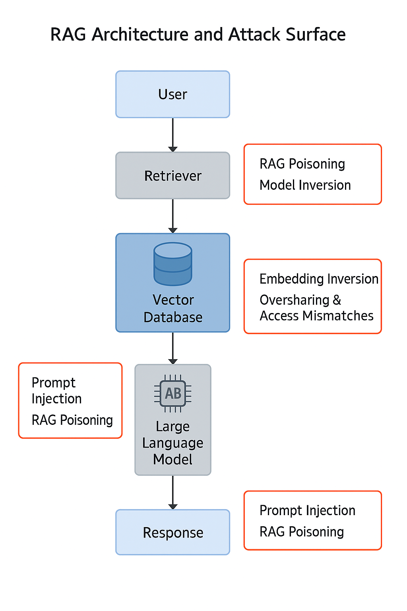

# Retrieval‑Augmented Generation (RAG) Security Pattern for Financial Enterprises – Enriched Version

This enriched edition adds visualisations and reference diagrams to support key sections of the original pattern.

# Retrieval-Augmented Generation (RAG) Security Pattern for Financial Enterprises

## 1. Introduction

This document delineates a comprehensive security pattern for implementing Retrieval-Augmented Generation (RAG) systems within a large financial enterprise. The objective is to provide a reusable, risk-based framework that ensures the protection of critical information assets throughout the entire RAG lifecycle, from initial data ingestion and vectorization to retrieval, augmentation, and final generation, encompassing all underlying infrastructure and data stores.

The strategic importance of RAG in financial services cannot be overstated. RAG significantly enhances the relevance of Large Language Model (LLM) responses, substantially reduces the occurrence of "hallucinations" (plausible but untrue outputs), and enables the provision of highly customized responses grounded in an organization's private and proprietary data. Within the financial sector, RAG offers distinct advantages, including improved decision-making capabilities for critical functions such as risk assessment and fraud detection. It effectively bridges the gap between structured and unstructured data, enhances customer interactions through more informed AI-driven recommendations, and plays a vital role in ensuring continuous compliance with evolving regulations.

Adopting a security pattern approach for RAG is a strategic imperative. Security patterns represent defined and reusable solutions to recurring cybersecurity problems, offering a standardized methodology for embedding security from the earliest design phases—a concept known as "Security by Design". This approach is particularly valuable for financial institutions, as it facilitates clear traceability of implemented controls back to the specific threats they are intended to mitigate. Such traceability is critical for demonstrating adherence to stringent regulatory and audit requirements. Furthermore, the standardization inherent in security patterns promotes consistency and reusability across complex enterprise environments, streamlining security efforts and reducing potential misconfigurations.

A fundamental tension exists within AI systems, including RAG: they generally perform better with access to more data, both for model training and as sources for retrieval. This creates a strong pull for data, yet historically, the protection mechanisms for this data within AI contexts have lagged, rendering these systems both high-value and high-risk targets. For a financial enterprise, where data is inherently sensitive and subject to rigorous regulation, this observation highlights a critical systemic challenge. The rapid adoption of AI could potentially outpace the establishment of mature data security practices specifically tailored for AI data flows and storage, thereby introducing significant vulnerabilities.

Moreover, RAG's capacity to aggregate and synthesize information from diverse internal data sources, such as SharePoint repositories, Customer Relationship Management (CRM) systems, Enterprise Resource Planning (ERP) platforms, and Human Resources (HR) systems, means it acts as a powerful, real-time data aggregator. This aggregation, combined with the risk of "oversharing and access mismatches" , indicates that the deployment of RAG systems will inevitably expose and bring to light existing weaknesses within an enterprise's broader data governance framework. Consequently, implementing this RAG security pattern is not merely about securing the RAG components themselves; it implicitly compels a comprehensive re-evaluation and strengthening of the foundational data governance practices that underpin and feed the RAG system, thereby improving the security posture of the entire data landscape within the financial enterprise.

## 2. Problem: The Evolving Security Landscape of RAG in Finance

### Figure 1 — RAG Data‑Flow & Attack‑Surface

The integration of Retrieval-Augmented Generation (RAG) systems introduces a new and complex set of security challenges, particularly within the highly sensitive environment of a large financial enterprise. Understanding the architecture and its inherent vulnerabilities is paramount to developing effective mitigation strategies.

A typical RAG process begins when a user submits a query. This query initiates a search through a vast knowledge base, which often leverages vector embeddings and semantic search techniques to identify and retrieve the most relevant documents. These retrieved documents then serve to "augment" the original prompt, providing additional context to a Large Language Model (LLM). The LLM subsequently uses this enriched context to generate a more accurate, relevant, and context-aware response. Key components of this architecture include the Knowledge Base (acting as the document store, frequently a vector database), the Retriever (the search engine component), the Generator (the LLM itself), and an Orchestration Layer that manages the workflow between these elements. Vector databases are central to this process, storing numerical representations of text, known as embeddings, which facilitate rapid similarity searches.

The inherent security challenges introduced by RAG systems are significant. RAG necessitates new infrastructure and introduces new types of data, often copies of private data that may be protected elsewhere. This expansion of infrastructure and data types inherently broadens the overall attack surface for an organization. A primary concern is the proliferation of private data within these new data stores, particularly vector databases. Furthermore, the increasing complexity of LLM and RAG applications makes it challenging for organizations to effectively maintain robust Responsible AI (RAI) programs.

Specific vulnerabilities and attack vectors in RAG workflows demand careful attention:

Vector Database Vulnerabilities: Vector embeddings, while efficient for retrieval, can be reversed to create near-perfect approximations of the original data through inversion attacks. These databases, often containing highly sensitive information, represent an "underprotected gold mine" for attackers due to their novel nature and the potential for new attack methods.

Oversharing and Access Mismatches: A significant risk arises from RAG workflows unintentionally exposing overshared documents from existing repositories like SharePoint, CRMs, ERPs, and HR systems. This occurs because vector databases typically lack the sophisticated, domain-specific business logic required to control granular access, leading to widespread data exposure that might not be intended or compliant with existing policies.

LLM Log Leaks: Sensitive user prompts, especially those augmented with private data, flow through RAG systems. These systems may, by default, keep logs of prompts and responses, creating a risk of compromise or leakage if not adequately secured.

RAG Poisoning / Data Poisoning: Malicious actors can intentionally insert false or tampered data into the knowledge base or vector database used by RAG. This can mislead the retrieval process, causing the system to produce incorrect or misleading outputs, a form of adversarial manipulation of training data.

Prompt Injection: Carefully crafted input prompts, or even malicious instructions embedded within retrieved documents, can exploit weaknesses in the RAG system. This can manipulate retrieval and generation operations, leading to the divulging of confidential information or bypassing intended security measures. The retrieval stage is particularly vulnerable because RAG systems often implicitly trust the data they retrieve from their knowledge sources, and may lack robust input validation mechanisms for this augmented context.

Information Leakage / Retrieval Data Leakage: Sensitive or private information from the knowledge base may be unintentionally exposed during the RAG retrieval process. Without robust access restrictions and filters, the system might retrieve and include privileged material in generated answers, leading to significant security and privacy breaches. This leakage can be either targeted (specific information extracted) or opportunistic (large volumes collected for later sifting).

Embedding Inversion Attack: This attack specifically aims to reconstruct the original data from its numerical vector embeddings. The ability to reconstruct original data with high accuracy underscores that embeddings require the same level of protection as the original sensitive data from which they were derived.

Membership Inference Attack (MIA): This attack attempts to determine whether a specific data point or a user's data was included in the retrieval dataset used to populate the vector datastore.

Adversarial Embedding Attacks: Sophisticated attackers can design specially crafted vector embeddings that are semantically similar to authentic data. These tampered embeddings can mislead the RAG system's similarity search algorithms, causing it to retrieve and utilize maliciously designed information during the generation process.

Model Tampering / Manipulation: Similar to traditional model poisoning, malicious data can be introduced to a RAG flow, affecting the output in undesirable ways, or attackers can directly tamper with vector databases.

Stale/Outdated Data: While RAG addresses the issue of LLMs relying on stale training data , the knowledge base itself can become outdated if not regularly updated. In a dynamic regulatory environment like finance, this can lead to inaccurate or non-compliant responses.

A critical observation is the shift in focus from solely model-centric AI security to a more data-centric approach. Traditional AI security efforts often concentrated on the LLM model itself, addressing risks such as poisoning during the training phase. However, RAG fundamentally introduces new and critical vulnerability points centered around the data pipeline and the vector database. Risks like data proliferation, oversharing, embedding inversion, retrieval data leakage, and RAG poisoning all directly pertain to the data and its storage and retrieval mechanisms, rather than solely the LLM's internal logic. This indicates that for RAG systems, security efforts must significantly expand to prioritize the protection and governance of these data assets and their unique storage formats (embeddings) before they are even used by the LLM for generation.

Furthermore, a significant vulnerability in RAG systems stems from an implicit assumption of trust. Organizations often treat their established information sources as inherently trustworthy. Consequently, RAG systems are frequently designed to treat the data they retrieve from these sources as trusted, without sufficient additional validation. This becomes particularly dangerous if an attacker has managed to inject malicious instructions or corrupted data into the source documents beforehand. This scenario creates a supply chain-like vulnerability where the integrity of the RAG output is directly dependent on the unquestioned integrity of the retrieved data, even if that data has been maliciously altered upstream. This highlights the necessity for continuous validation and sanitization of the knowledge base itself, not just the user input, to ensure the trustworthiness of the data being fed into the LLM.

Table 1: Key RAG Security Risks and Their Financial Impact

## 3. Context: Operating RAG within a Regulated Financial Enterprise

### Figure 3 — Document Metadata Flow

Operating Retrieval-Augmented Generation (RAG) systems within a large financial enterprise presents a unique set of opportunities and challenges, primarily due to the highly regulated nature of the industry and the inherent sensitivity of the data involved. The IT environment of such an enterprise is characterized by the handling of extremely sensitive data, including Personally Identifiable Information (PII), financial transactions, and proprietary business strategies, all of which demand stringent protection measures. These environments often feature a complex blend of legacy IT infrastructure and modern cloud-based and AI deployments. Across this diverse landscape, there is an unwavering emphasis on maintaining data integrity, availability, and confidentiality, which are the foundational pillars of information security management, as defined by standards like ISO 27001. Consequently, financial institutions require robust capabilities for continuous monitoring, comprehensive audit trails, and efficient incident response to uphold their security posture.

The deployment of RAG systems must align with a complex web of key regulatory and compliance obligations:

NIST Publications: The National Institute of Standards and Technology (NIST) Special Publication (SP) 800 Series is widely regarded as the gold standard for information security, offering detailed guidelines on cybersecurity practices, risk management, and incident response.

NIST SP 800-53 Revision 5 is particularly relevant, as it introduces unified security and privacy controls applicable to any system handling data, including industrial systems, IoT devices, and cyber-physical systems. This revision integrates new controls based on empirical threat data and emphasizes a Zero Trust Architecture approach.

NIST AI 100-2e2025, titled "Adversarial Machine Learning: A Taxonomy and Terminology of Attacks and Mitigations," provides voluntary guidance for identifying, addressing, and managing risks associated with adversarial machine learning (AML) attacks on Generative AI (GenAI) systems. It specifically addresses evasion, poisoning, privacy, and misuse attacks relevant to RAG.

NIST SP 800-30, the "Guide for Conducting Risk Assessments," offers a systematic approach to identifying, assessing, and prioritizing risks, emphasizing thorough documentation and clear communication of findings.

ISO 27001 Standards: ISO 27001 is an international standard for Information Security Management Systems (ISMS), which mandates requirements for establishing, implementing, maintaining, and continually improving an ISMS to secure the confidentiality, integrity, and availability of information.

ISO 27001:2022 Annex A Controls lists 93 specific security controls grouped into Organizational, People, Physical, and Technological themes. Organizations must select controls based on their risk assessment and justify their inclusion or exclusion in a Statement of Applicability (SoA).

Financial-Specific Regulations:

U.S. Financial Regulations from agencies such as the SEC, FINRA, Federal Reserve, and FDIC, mandate stringent requirements for AI models. These include documenting and validating AI models, continuous monitoring, regular testing, and maintaining thorough documentation of model architecture, training data, version control, and comprehensive audit trails.

Data Residency Laws are legal requirements dictating that certain types of data, particularly sensitive financial and personal data, must be stored and processed within a specific country or jurisdiction. Many countries have enacted such laws, necessitating region-specific hosting options or on-premise solutions for LLMs and AI components to ensure compliance.

The General Data Protection Regulation (GDPR) enforces strict regulations on cross-border data transfers, which significantly impacts AI systems handling sensitive data from EU citizens.

The EU AI Act establishes a risk-based regulatory framework for AI systems, with particular scrutiny on high-risk applications such as those used for evaluating creditworthiness. It emphasizes transparency, fundamental rights impact assessments, and alignment with existing data protection laws like GDPR. Non-compliance with the EU AI Act can incur substantial penalties, potentially reaching up to €35 million or 7% of a company's total worldwide annual turnover.

In the United States, AI regulations are a patchwork of varying requirements primarily managed at the state level. States like California, Colorado, and Illinois have enacted laws addressing training data transparency, disclosure of AI-driven lending decisions, and oversight of predictive analytics in consumer finance.

Anti-Money Laundering (AML) and Financial Crime (FinCrime) Regulations increasingly rely on AI/ML for fraud detection and AML compliance. This necessitates that AI systems used in these areas are explainable and auditable to justify decisions and maintain regulatory confidence.

Critical considerations for RAG implementation in this context include:

Data Residency: This is paramount for compliance, data security, confidentiality, and disaster recovery. It requires careful selection of cloud providers that offer region-specific hosting or the adoption of locally hosted/on-premise solutions to ensure data remains within specified jurisdictions.

Explainability (XAI): Essential for regulatory compliance, fostering trust, mitigating risks, and addressing ethical considerations. Financial institutions must be able to understand and validate the reasoning behind AI-driven decisions, especially for high-stakes applications like loan approvals or fraud detection. XAI directly addresses the "black box" problem inherent in many complex AI models.

Auditability: Regulators and internal audit teams require the ability to scrutinize AI models and their outputs. This necessitates maintaining detailed audit trails and ensuring the traceability of AI-generated insights to their source data and decision logic. Audit logs are vital for identifying errors, optimizing models, and refining compliance strategies.

The research highlights a significant convergence of requirements from various regulatory bodies. For instance, NIST AI 100-2e2025 provides a taxonomy for adversarial machine learning attacks, including those relevant to financial crime. Simultaneously, ISO 27001:2022 includes controls such as data masking and data leakage prevention , which directly mitigate data leakage risks, while financial-specific regulations explicitly demand explainability and auditability. This is not merely a collection of disparate regulations; it represents an intricate web where a security control implemented to satisfy one standard (e.g., access control under ISO 27001) simultaneously contributes to compliance with another (e.g., data privacy under GDPR or data residency laws). This interconnectedness underscores that a holistic, integrated compliance strategy is essential, where the implementation of a comprehensive RAG security pattern can simultaneously address multiple regulatory obligations, leading to more efficient and effective security outcomes.

A profound challenge for AI adoption in finance is the "black box" problem. Many advanced AI models, particularly deep learning-based systems, operate as "black boxes," making it inherently difficult to explain their internal reasoning or decision-making processes. This contrasts sharply with the explicit and growing regulatory demand for transparency, explainability, and auditability within financial services. This is not merely a technical hurdle; it represents a fundamental conflict between the inherent opacity of certain AI models and the legal and ethical imperative for accountability in a highly regulated industry. The implication is that financial institutions cannot simply deploy off-the-shelf "black box" RAG solutions without significant additional effort in developing or integrating explainable AI (XAI) techniques. Failure to do so risks severe non-compliance penalties, compelling architectural choices that favor more interpretable models or robust post-hoc explainability frameworks.

Table 3: Financial Regulatory Requirements and RAG Compliance Implications

## 4. Threat Model: Identifying and Categorizing RAG-Specific Threats

### Figure 4 — RAG Architecture and Attack Surface

A robust security posture for Retrieval-Augmented Generation (RAG) systems in a financial enterprise necessitates a comprehensive threat model that identifies, categorizes, and assesses the potential impact of various attack vectors. The landscape of threats to AI and Machine Learning (ML) systems, particularly Generative AI (GenAI), is continuously evolving, as highlighted by publications from NIST and frameworks like OWASP.

NIST AI 100-2e2025, "Adversarial Machine Learning: A Taxonomy and Terminology of Attacks and Mitigations," provides a foundational understanding of adversarial machine learning (AML) attacks targeting AI/ML systems, including GenAI. This guidance details how attackers can target different phases of ML operations, including adversarial manipulation of training data, adversarial inputs designed to adversely affect system performance, and malicious manipulations or modifications of models to exfiltrate sensitive data. For GenAI systems, key attack types include Evasion, Poisoning, Privacy, and Misuse attacks.

Complementing NIST's guidance, the OWASP 2025 Top 10 Risks for LLMs and Gen AI Apps identifies specific risks directly associated with RAG systems. These include Prompt Injection, Data Leakage, Embedding Inversion, Data Poisoning, Cross-Context Information Conflicts, and Unintentional Behavior Alterations.

A detailed analysis of these threats, with specific relevance to RAG in a financial context, includes:

Data Poisoning (RAG Poisoning): This threat involves the intentional insertion of false, biased, or malicious data into the knowledge base (retrieval dataset) or the vector database that RAG relies upon. Such poisoned data can mislead the retrieval process, causing the LLM to generate incorrect, misleading, or even harmful outputs. A "devious employee" could, for example, add or update documents crafted to give executives bad information through chatbots. This aligns directly with "Poisoning attacks" in the NIST AML Taxonomy for GenAI systems.

Prompt Injection: This attack involves crafting malicious instructions within the user's input prompt or embedding them within documents that are retrieved and used to augment the prompt. The RAG system, often designed to trust its retrieved context, can then be manipulated to divulge confidential information, bypass security measures, or perform unintended actions. The retrieval stage is particularly vulnerable due to this implicit trust and a potential lack of robust input validation mechanisms for the augmented data. This can be considered a form of "Evasion attack" if designed to bypass safety filters.

Information Leakage (Retrieval Data Leakage / Data Disclosure): Sensitive or private information from the retrieval dataset can be unintentionally exposed to unauthorized entities, either during the retrieval process itself or even during the embedding process. This risk is amplified in the absence of robust access restrictions and filters, allowing the system to retrieve and include privileged material in generated answers. Such leakage can be targeted (specific information extracted) or opportunistic (large volumes of data collected for later analysis). Furthermore, LLM logs themselves can inadvertently contain and leak sensitive data from user prompts and augmented contexts. This falls under "Privacy attacks" in the NIST AML Taxonomy for GenAI systems.

Embedding Inversion Attack: This sophisticated attack aims to reconstruct the original sensitive data from its numerical vector embeddings. Attackers can achieve this by leveraging the exact embedding model used for computation or by training a surrogate model. Given that vector databases store embeddings derived from private data, they represent a high-value target for attackers. It is critical to recognize that embeddings require the same level of protection as the original data. This is categorized as a "Privacy attack" by NIST.

Membership Inference Attack (MIA): This attack attempts to determine whether specific data (e.g., a particular customer's record or a sensitive transaction) was included in the retrieval dataset used to populate the vector datastore. It can reveal if a user's data or a specific sample was part of the RAG's knowledge base. This also falls under "Privacy attacks" in the NIST AML Taxonomy.

Oversharing and Access Mismatches: A significant vulnerability stems from the fact that vector databases, by their nature, often lack the granular, domain-specific business logic required to control "who can see what". This can lead to a "massive oversharing" of sensitive data pulled from various enterprise systems like CRMs, ERPs, and HR systems, effectively centralizing access to data that was previously protected by siloed, application-specific access controls.

Stale/Outdated Data: While RAG is designed to overcome the limitation of LLMs having "stale training data" , the knowledge base that feeds the RAG system can itself become outdated if not regularly updated. In a rapidly changing regulatory environment like financial services, relying on stale information can lead to inaccurate or non-compliant responses, undermining the very purpose of RAG.

Adversarial Embedding Attacks: These attacks involve designing specially crafted vector embeddings that are semantically similar to authentic data but contain malicious intent. Such tampered embeddings can mislead the RAG system's similarity search algorithms, causing it to retrieve and utilize maliciously designed information during the generation process, effectively subverting the retrieval mechanism.

Model Tampering / Manipulation: Similar to traditional model poisoning, malicious data can be introduced into the RAG flow to affect the output in undesirable ways. Attackers can also directly tamper with the vector databases, corrupting the embeddings or their indexing.

The impact of these threats on financial assets and operations can be severe:

Confidentiality Breaches: Unauthorized disclosure of Personally Identifiable Information (PII), sensitive financial records, or proprietary trading strategies.

Integrity Compromise: Maliciously altered data leading to incorrect financial advice, fraudulent transactions, flawed risk assessments, or biased lending decisions.

Availability Issues: System downtime or degraded performance due to attacks or resource management challenges, impacting real-time retrieval and processing capabilities.

Regulatory Non-Compliance: Significant fines, legal penalties, and sanctions, such as those under the EU AI Act, which can reach up to €35 million or 7% of annual turnover for serious infringements.

Reputational Damage: Loss of customer trust, negative publicity, and erosion of market confidence, impacting the institution's standing and future business.

Financial Loss: Direct monetary losses from fraud, incorrect AI-driven decisions, or the substantial costs associated with incident response, remediation, and legal defense.

A critical observation in RAG security is the shift in the "trust boundary." In traditional security models, clear trust boundaries are established, often at the perimeter of a system or application. However, in RAG, the "knowledge base" from which information is retrieved is frequently treated as implicitly trusted. Threats like RAG poisoning and adversarial embedding attacks demonstrate that the source data itself, or its vectorized representation within the knowledge base, can be compromised. This implies that the trust boundary must extend much deeper into the data pipeline, necessitating continuous validation and integrity checks of the data within the knowledge base and vector database, not just at the initial ingestion point. The RAG system cannot simply trust its own "memory" or retrieved context without verification.

Furthermore, RAG systems can act as an amplifier of existing data governance weaknesses. The "oversharing and access mismatches" risk is particularly potent because it highlights that RAG does not necessarily create entirely new types of access control problems. Instead, it significantly amplifies pre-existing, often overlooked, granular access control deficiencies in source systems like SharePoint, CRMs, and ERPs. By pulling data from disparate, potentially overshared repositories into a single, often less-protected vector database, RAG inadvertently centralizes and exposes these pre-existing weaknesses on a much larger scale, making them more accessible to attackers. This means that a comprehensive RAG security strategy must include a thorough audit and remediation of access controls on the source data systems that feed the RAG, rather than focusing solely on the RAG components themselves.

## 5. Solution: Designing a Secure RAG Architecture

### Figure 5 — Secure RAG Architecture (Component View)

### Figure 2 — Secure RAG Reference Architecture

Designing a secure Retrieval-Augmented Generation (RAG) architecture for a financial enterprise requires adherence to fundamental security principles and the implementation of robust architectural components throughout the system's lifecycle.

Core Security Principles for RAG:

Security by Design: Security considerations must be integrated from the initial design and development phases of the RAG system, rather than being treated as an afterthought. This proactive approach ensures that security is baked into the very fabric of the architecture.

Data Minimization: Only the data strictly necessary for the RAG system's intended functionality should be collected, processed, and stored. This principle reduces the overall attack surface and limits the potential impact of a breach.

Least Privilege: Users, applications, and system components should be granted only the minimum access rights and permissions required to perform their specific functions. This limits the damage that can be caused by compromised accounts or components.

Defense in Depth: Employing multiple, overlapping layers of security controls ensures that if one control fails, others are in place to mitigate the threat. This multi-layered approach provides robust protection against various attack vectors.

Transparency and Explainability (XAI): RAG systems must be designed to be interpretable, allowing for a clear understanding and validation of their decisions. This is crucial for meeting regulatory compliance requirements in the financial sector, where accountability for AI-driven outcomes is paramount.

Auditability and Traceability: All data flows, model decisions, and system interactions within the RAG architecture must be comprehensively logged and auditable. This provides the necessary evidence for compliance, incident investigation, and performance monitoring.

Resilience: The RAG system should be designed with fault tolerance and the ability to rapidly recover from security incidents, ensuring continuous operation and minimizing disruption to critical financial services.

Architectural Components of a Secure RAG Implementation:

Secure Data Ingestion Pipeline: This component is critical for ensuring the integrity and confidentiality of data entering the RAG system.

Implement robust data validation and sanitization at all ingestion points to prevent data poisoning and the introduction of malformed or malicious inputs.

Apply comprehensive data classification and labeling, aligning with organizational policies and ISO 27001:2022 Annex A Organizational controls, to ensure appropriate handling based on sensitivity.

Ensure encryption of all data in transit to protect against interception during transfer.

Hardened Vector Database: As a central repository for sensitive embeddings, the vector database requires stringent security measures.

Implement strong encryption of data at rest to protect against unauthorized access to stored embeddings.

Enforce granular access controls, such as Role-Based Access Control (RBAC) or Attribute-Based Access Control (ABAC), adhering to the principle of least privilege.

Conduct regular security assessments and vulnerability scanning to identify and remediate weaknesses.

Implement specific protections against embedding inversion attacks, recognizing that embeddings are highly sensitive and can be reconstructed into original data.

Secure LLM Integration: The interface with the LLM must be secured to prevent manipulation and leakage.

Apply rigorous input filtering and sanitization for all prompts to mitigate prompt injection attacks.

Implement output validation mechanisms to detect and filter out hallucinations or potentially malicious content generated by the LLM.

Explore and utilize confidential computing environments for running LLMs, which can significantly minimize the risk of leakage from sensitive prompts and retrieved data during processing.

Deploy secure API gateways to manage and control all external LLM calls, enforcing authentication, authorization, and rate limiting.

Robust Orchestration Layer: This layer manages the complex data flow between the retriever and the generator.

It must be designed to enforce security policies, including granular access control based on user identity and the sensitivity of the data being retrieved and generated.

This layer plays a critical role in ensuring that only authorized data is presented to the LLM and only authorized responses are returned to the user.

Centralized Logging and Monitoring: Comprehensive visibility into RAG operations is essential for security.

Implement extensive logging of all RAG interactions, data access events, query histories, and system activities.

Deploy real-time anomaly detection systems to identify suspicious activities, unusual retrieval patterns, or potential prompt injection attempts.

Ensure secure storage and protection of logs, utilizing techniques such as read-only recording or cryptographic hashing to prevent unauthorized modification or deletion.

Secure Data Flow and Lifecycle Management within RAG:

Data Lineage: Implement robust data lineage tracking capabilities to trace the journey of data from its origin through ingestion, embedding, retrieval, and its ultimate use by the LLM. This provides crucial transparency, ensures data trustworthiness, and supports comprehensive auditability.

Data Retention and Anonymization: Define and enforce clear policies for data retention periods for all RAG-related data (e.g., raw documents, embeddings, logs). Implement effective anonymization techniques for sensitive information within the RAG pipeline, carefully balancing data usability with strict privacy compliance requirements.

Version Control: Maintain rigorous version control for all data in the knowledge base, vector database, and for the RAG models themselves. This allows for reproducibility, facilitates rapid rollback in case of data corruption or security incidents, and is crucial for auditability.

Secure Development Lifecycle (SDLC): Integrate security considerations throughout the entire RAG application development lifecycle. This includes secure coding practices, regular vulnerability testing (e.g., penetration testing, code scanning), and strict separation of development, testing, and production environments.

The financial sector's extreme sensitivity to data leakage and the risk of sensitive prompts being exposed through LLM logs underscores the imperative of adopting advanced protection mechanisms. Confidential computing environments, where LLMs can operate on encrypted data without exposing it even to the underlying infrastructure provider, represent a significant leap forward in mitigating these risks. This technology moves beyond traditional encryption (data at rest and in transit) to protect data in use, directly addressing the concern of sensitive prompts and retrieved data being exposed during processing within the LLM or vector database, even from privileged insiders or compromised cloud environments. Its adoption represents a proactive and advanced mitigation strategy for financial institutions.

The holistic approach to data security outlined for the RAG pipeline, encompassing secure data ingestion, hardened vector databases, secure LLM integration, and comprehensive data lifecycle management (including data lineage, retention, and anonymization) , reveals a broader implication. RAG systems cannot operate securely in isolation. Their secure deployment necessitates a unified data governance framework that spans traditional data stores, novel vector databases, and the intricate interactions with AI models. This will compel financial enterprises to integrate previously siloed data security and governance policies into a cohesive, end-to-end data lifecycle management strategy that specifically accounts for the unique characteristics and risks of AI-driven data. This integration is vital for achieving a truly resilient and compliant RAG environment.

## 6. Controls: Implementing NIST and ISO 27001 Safeguards

### Figure 6 — Threat‑to‑Control Matrix

The implementation of a secure RAG architecture within a financial enterprise must be underpinned by a robust selection of security controls derived from established frameworks, notably NIST SP 800-53 Revision 5 and ISO 27001:2022 Annex A. This section details how these controls map to and mitigate the specific threats identified for RAG systems, emphasizing a risk-based selection approach.

NIST SP 800-53 Revision 5 is a cornerstone for information security, uniquely unifying security and privacy controls for all data-handling systems, extending their applicability beyond traditional information systems to encompass any system that processes data, including industrial systems, IoT devices, and cyber-physical systems.

Mapping NIST SP 800-53 Revision 5 Controls to RAG Security Objectives:

AC - Access Control : This control family is critical for RAG, requiring the implementation of granular access controls (e.g., Role-Based Access Control (RBAC), Attribute-Based Access Control (ABAC)) for vector databases, knowledge bases, and LLM APIs. This directly prevents oversharing and unauthorized access to sensitive financial data. Specifics include managing privileged access rights and ensuring access to RAG components is strictly based on job roles and the principle of need-to-know.

AU - Audit and Accountability : Essential for transparency and accountability, this family mandates comprehensive logging of all RAG interactions, data access events, query histories, and system activities. It also requires the protection of audit information from unauthorized modification or deletion. Logs should capture user IDs, system activities, event timestamps, device identity, and network addresses, which are crucial for auditability and incident investigation.

CM - Configuration Management : This family focuses on establishing baseline configurations for all RAG components (e.g., vector database settings, LLM parameters, orchestration layer configurations) and maintaining secure repositories for source code. It ensures that changes to RAG system configurations are managed to prevent the introduction of vulnerabilities and maintain integrity.

CP - Contingency Planning : This control family addresses the need for robust backup and recovery procedures for RAG's critical data stores, including vector databases and knowledge bases. This ensures RAG system availability and data integrity in the event of system failures or attacks.

IA - Identification and Authentication : Strong authentication mechanisms, such as Multi-Factor Authentication (MFA), must be implemented for all users and services interacting with RAG components. This enhances security by requiring additional verification steps beyond simple passwords.

IR - Incident Response : This family requires the development and regular testing of a specific incident response plan tailored to RAG-related security incidents, including data breaches, poisoning attacks, and prompt injections. The plan should outline clear procedures for detection, containment, analysis, communication, and recovery.

MP - Media Protection : This control family focuses on safeguarding physical and digital media that store RAG data, including vector database backups and knowledge base documents, ensuring their secure handling, storage, and disposal.

PS - Personnel Security : This family addresses the human element of security, requiring appropriate screening, ongoing training, and access agreements for all personnel with access to RAG systems and sensitive data.

RA - Risk Assessment : Regular and comprehensive risk assessments specific to RAG systems are essential to continuously identify vulnerabilities, analyze threats, and prioritize mitigation efforts.

Applying ISO 27001:2022 Annex A Controls to RAG Components:

ISO 27001:2022 Annex A provides a list of 93 security controls categorized into Organizational, People, Physical, and Technological themes, which are selected based on an organization's risk assessment and justified in a Statement of Applicability (SoA).

Organizational Controls:

A.5.1 Information Security Policies: Define clear, documented policies for RAG data handling, usage, and security, ensuring alignment with overall enterprise security objectives.

A.5.15 Access Control : Develop, document, and periodically review access control policies for all RAG assets, ensuring secure, role-based, and least-privilege access. This includes access to knowledge bases, vector databases, and LLM APIs, preventing unauthorized information disclosure.

A.5.16 Identity Management: Establish and manage user identities and their lifecycle for effective access to RAG systems.

A.5.18 Access Rights: Define and manage specific access rights for RAG components and data, ensuring that permissions are appropriate to roles and responsibilities.

A.5.24 Information Security Incident Management Planning and Preparation : Establish robust processes for managing RAG-related security incidents, including standardized reporting, effective response procedures, and continuous improvement based on lessons learned.

People Controls:

A.6.3 Information Security Awareness, Education and Training: Provide targeted training for all personnel involved in RAG development, deployment, and operation on RAG-specific security risks, such as prompt injection awareness, secure data handling, and recognizing potential data poisoning.

Physical Controls:

A.7.1 Physical Security Perimeters: Implement physical security measures to protect the locations housing RAG infrastructure, including servers and data centers, against unauthorized access.

Technological Controls:

A.8.1 Data Masking: Implement data masking techniques for sensitive data used in non-production RAG environments or for certain outputs to protect privacy.

A.8.10 Information Deletion: Establish procedures for the secure and timely deletion of RAG data, such as old embeddings or temporary logs, when no longer needed, especially for sensitive information.

A.8.12 Data Leakage Prevention (DLP): Deploy DLP measures to prevent the unauthorized exfiltration of sensitive data from RAG systems, including vector databases and LLM outputs.

A.8.13 Information Backup: Implement regular backup procedures for RAG knowledge bases and vector databases to ensure data recoverability and business continuity.

A.8.15 Logging : Mandates the production, secure storage, protection, and analysis of logs for all RAG activities, exceptions, and security events. Logs must be complete, accurate, and safeguarded against unauthorized modification using techniques like read-only recording or cryptographic hashing.

A.8.16 Monitoring Activities: Implement specific monitoring activities for RAG systems to detect anomalies, suspicious retrieval patterns, and potential security incidents in real-time.

A.8.25 Secure Development Life Cycle (SDLC) : Integrate security throughout the RAG application development lifecycle. This includes adherence to secure coding practices (A.8.28), regular vulnerability testing (A.8.29), and strict separation of development, testing, and production environments (A.8.31).

A.8.28 Secure Coding: Ensure that all code developed for RAG applications adheres to secure coding standards and best practices to prevent common vulnerabilities that could be exploited.

The selection of controls must always be risk-based, tailored to the specific threats identified for the RAG systems within the financial enterprise. This involves prioritizing controls based on the likelihood and potential impact of RAG-specific risks, as guided by methodologies like NIST SP 800-30. All inclusions and exclusions of controls must be thoroughly justified in the organization's Statement of Applicability (SoA).

The "unified" nature of NIST 800-53 Revision 5 is particularly advantageous for RAG security. By integrating security and privacy controls into a single standard applicable to any data-handling system , it ensures that privacy considerations are not an afterthought but are deeply embedded within the security framework. For RAG, which inherently processes sensitive data and faces privacy risks such as embedding inversion and data leakage , this unified approach means that financial institutions can leverage a single, integrated framework to address both security and privacy risks simultaneously. This streamlines compliance efforts and ensures a more comprehensive data protection posture.

Furthermore, the ISO 27001:2022 update demonstrates a proactive adaptation to emerging AI-specific threats. The significant changes to Annex A, including the addition of new technological controls such as "Data masking (8.1)," "Information deletion (8.10)," "Data leakage prevention (8.12)," "Monitoring activities (8.16)," and "Secure coding (8.28)" , directly address many of the unique RAG-specific risks identified earlier (e.g., mitigating embedding inversion, preventing data leakage, securing LLM logs, and defending against prompt injection). This evolution within the ISO standard indicates that it is increasingly "AI-aware." For a financial enterprise, adopting ISO 27001:2022 provides a robust, internationally recognized framework that inherently supports the integration of RAG security into an existing Information Security Management System (ISMS), providing a strong basis for demonstrating due diligence and compliance.

Table 2: Threat-to-Control Traceability Matrix for RAG

## 7. Implementation Considerations and Best Practices

### Figure 7 — RAG Data Lifecycle & Governance

Successful and secure implementation of a RAG system within a financial enterprise extends beyond architectural design and control mapping. It requires a continuous, holistic approach that integrates RAG security into broader enterprise processes and leverages best practices for ongoing management.

Robust Data Governance for RAG: Effective data governance is foundational for the trustworthiness and compliance of RAG systems.

Data Lineage: It is imperative to implement robust data lineage tracking capabilities. This allows for tracing data from its original source through every stage of the RAG pipeline—ingestion, embedding, retrieval, and its ultimate use by the LLM. This end-to-end visibility ensures the trustworthiness of the data, provides transparency into its transformations, and is critical for supporting comprehensive auditability, especially in a regulated financial environment.

Data Versioning: Maintaining rigorous version control for all data within the knowledge base and vector database is essential. This practice ensures reproducibility of outputs and enables quick rollback to previous states in case of data corruption or security incidents.

Data Retention and Anonymization: Clear policies must be defined and enforced for data retention periods for all RAG-related data, including raw documents, embeddings, and temporary logs. Additionally, sophisticated anonymization techniques should be implemented for sensitive information within the RAG pipeline, carefully balancing data usability with strict privacy compliance standards.

Data Quality Checks: Implementing rigorous data validation techniques at the point of ingestion is crucial to ensure the accuracy, completeness, and integrity of all data entering the knowledge base. This proactive measure is vital in preventing data poisoning attacks and ensuring reliable RAG outputs.

Strategies for Achieving Explainability and Auditability (XAI): Given the "black box" nature of many AI models and the stringent regulatory demands in finance, explainability and auditability are non-negotiable.

Model Documentation: Thoroughly document the RAG model architecture, its underlying decision logic, the sources and parameters of its training data, and all version control changes. This provides a transparent record of the model's development and behavior.

Audit Trails: Maintain comprehensive audit logs of all interactions with RAG systems. This includes user queries, the specific documents retrieved, the LLM's responses, and any modifications made to the knowledge base or system configurations. These logs are indispensable for regulatory scrutiny and incident investigation.

Post-Hoc Explainability Techniques: For complex LLMs that may function as "black boxes," apply post-hoc explainability techniques to render their decisions understandable. This allows financial institutions to interpret and validate the reasoning behind critical AI-driven outcomes.

Human Oversight: Maintain a balance between automation and human expertise. Human review and verification of AI-generated findings are essential, especially in high-stakes financial applications like fraud detection or credit decisions, to ensure accuracy, fairness, and compliance.

Ensuring Data Residency and Managing Cross-Border Data Transfers: Compliance with data residency laws is a critical and complex requirement for global financial institutions.

Local Hosting: Prioritize the use of locally hosted LLMs and regional data centers for vector databases to comply with jurisdictional data residency laws, particularly for sensitive financial data.

Cloud Provider Selection: Carefully select cloud providers that offer region-specific hosting options and can demonstrate their ability to meet all applicable compliance regulations for data storage and processing.

International Transfer Agreements: Where cross-border data flows are unavoidable, establish robust international data transfer agreements and mechanisms, ensuring strict compliance with regulations such as GDPR and other relevant data protection frameworks.

Continuous Monitoring, Threat Detection, and Incident Response for RAG: A proactive security posture requires constant vigilance.

Real-time Monitoring: Deploy AI-driven monitoring tools capable of detecting unusual activity, anomalous retrieval patterns, potential breaches, or prompt injection attempts in real-time.

Threat Intelligence: Integrate relevant threat intelligence feeds to stay continuously updated on emerging RAG-specific attack vectors, vulnerabilities, and adversarial machine learning techniques.

Incident Response Plan: Develop and regularly test a specific incident response protocol tailored for RAG systems. This plan should clearly outline steps for detection, containment, analysis, and recovery for RAG-specific incidents like data poisoning or prompt injection, including predefined playbooks.

Regular Audits: Conduct periodic security audits of RAG systems and their associated data flows to identify vulnerabilities, assess control effectiveness, and ensure ongoing compliance with internal policies and external regulations.

Integrating RAG Security into Enterprise Architecture Frameworks: For a large financial enterprise, RAG security cannot exist in a silo; it must be integrated into the broader enterprise security architecture.

Align with SABSA: Leverage established frameworks like SABSA (Sherwood Applied Business Security Architecture), which explicitly cater to security patterns, to integrate RAG security into the conceptual and logical layers of the enterprise architecture.

Roles and Responsibilities: Establish clear roles and responsibilities for RAG system management, data security, and incident response across relevant teams (e.g., AI/ML engineering, data governance, cybersecurity operations).

Policy Alignment: Ensure that RAG security practices are fully aligned with and integrated into the broader enterprise IT policies and governance frameworks, fostering a cohesive security posture across the organization.

Zero Trust Architecture (ZTA): Apply Zero Trust Architecture principles—continuous authentication, least privilege access, and real-time threat detection—to all RAG components. This approach significantly mitigates sophisticated cyber risks by never implicitly trusting any user or device, regardless of their location.

The detailed implementation considerations for RAG, encompassing robust data governance, explainability, auditability, and data residency, provide concrete mechanisms for operationalizing the broader principles of "Responsible AI" (RAI) within a financial context. While RAI is a broad concept , practices like comprehensive data lineage directly support transparency and accountability, and explainable AI techniques address fairness and interpretability. This indicates that RAG, despite introducing new risks, also serves as a practical proving ground for embedding RAI principles directly into critical business operations, effectively moving RAI from theoretical guidelines to actionable security and compliance requirements.

Furthermore, the financial regulatory landscape for AI is characterized by rapid evolution and a degree of uncertainty, with new state and international laws continuously emerging. The strategic recommendation to "align with emerging global standards" and "consider adopting voluntary standards to stay ahead of the regulation" is critical. This approach is not merely about meeting current compliance obligations; it is about building a flexible, adaptable RAG security posture that can absorb future regulatory changes without requiring a complete overhaul. Financial institutions that proactively implement robust RAG security patterns based on principles such as explainable AI, strong data governance, and strict data residency will gain a significant competitive advantage by reducing future compliance costs, accelerating responsible AI adoption, and maintaining stakeholder trust in a dynamic environment.

## 8. Conclusion and Recommendations

Retrieval-Augmented Generation (RAG) systems offer transformative benefits for financial services, enhancing decision-making, improving customer interactions, and ensuring compliance by grounding Large Language Models in up-to-date, proprietary data. However, this powerful capability introduces unique and substantial security risks, particularly concerning sensitive data handling, the vulnerabilities inherent in vector databases, and the spectrum of adversarial attacks targeting AI systems. For a large financial enterprise, a comprehensive, pattern-based security approach, meticulously aligned with NIST publications and ISO 27001 standards, is not merely a best practice but a fundamental regulatory imperative. Successful and secure RAG deployment necessitates a holistic strategy that integrates robust data governance, ensures explainability and auditability, and maintains continuous monitoring and threat response capabilities.

Based on this analysis, the following key recommendations are provided for the financial enterprise:

Adopt a RAG Security Pattern as a Standardized Blueprint: Implement this security pattern as a mandatory, reusable framework for all RAG deployments across the enterprise. This will ensure consistency in security controls, streamline architecture reviews, and provide clear traceability between threats and their mitigations, which is essential for audit and compliance.

Prioritize Data-Centric Security for RAG: Shift security focus to the entire data lifecycle within RAG. This includes mandating robust encryption of all RAG-related data both at rest and in transit, implementing granular access controls (e.g., Attribute-Based Access Control) for vector databases and knowledge bases, and actively exploring the adoption of confidential computing environments for sensitive RAG workloads to protect data in use.

Strengthen Enterprise Data Governance for AI: Establish and enforce comprehensive data lineage, versioning, retention, and anonymization policies specifically tailored for RAG data. Implement rigorous data quality checks at the ingestion layer to prevent data poisoning and ensure the integrity and trustworthiness of the knowledge base. This will address the amplification of existing data governance weaknesses by RAG.

Invest in Explainable AI (XAI) and Auditability: Design RAG systems with built-in transparency and interpretability from the outset. Maintain detailed, immutable audit trails for all RAG interactions, including user queries, retrieved documents, LLM responses, and system modifications. Ensure human oversight mechanisms are in place to verify AI-generated findings, particularly for high-stakes financial decisions, to meet stringent regulatory demands for accountability.

Ensure Proactive Data Residency Compliance: Strategically plan data storage locations for RAG components, prioritizing local hosting or selecting cloud regions that explicitly meet all relevant jurisdictional data residency laws. Establish robust international data transfer agreements where cross-border data movement is unavoidable, ensuring full compliance with regulations like GDPR.

Implement Proactive Threat Detection and Response: Establish continuous, real-time monitoring of RAG systems for anomalous activities, suspicious retrieval patterns, and potential adversarial attacks (e.g., prompt injection, data poisoning). Integrate threat intelligence feeds to stay ahead of emerging RAG-specific attack vectors and develop well-defined, regularly tested incident response plans specifically for RAG-related security incidents.

Integrate Security into the RAG Development Lifecycle: Embed security practices throughout the entire RAG application development lifecycle (Secure SDLC), from secure design principles and threat modeling to secure coding practices, automated vulnerability testing, and strict separation of development, testing, and production environments.

Foster Continuous Improvement: Recognize that the threat landscape and regulatory environment for AI are dynamic. Regularly review and update the RAG security pattern and its associated controls in response to evolving threats, new attack techniques, and changes in regulatory requirements, leveraging the iterative approaches advocated by NIST and ISO.

#### Works cited

1. How to Write A Security Pattern - Defining Patterns - SecurityPatterns.io, https://securitypatterns.io/what-is-a-security-pattern/ 2. How to Write A Security Pattern - Getting Started - SecurityPatterns.io, https://securitypatterns.io/docs/quick-guide 3. Security Risks with RAG Architectures - IronCore Labs, https://ironcorelabs.com/security-risks-rag/ 4. RAG Security: Risks and Mitigation Strategies, https://www.lasso.security/blog/rag-security 5. Data Governance for Retrieval-Augmented Generation (RAG) - Enterprise Knowledge, https://enterprise-knowledge.com/data-governance-for-retrieval-augmented-generation-rag/ 6. RAG Architecture for Financial Compliance Knowledge Retrieval - Auxiliobits, https://www.auxiliobits.com/blog/rag-architecture-for-domain-specific-knowledge-retrieval-in-financial-compliance/ 7. Unlock AI's full potential in finance with RAG, vector search, and BBQ | Elastic Blog, https://www.elastic.co/blog/ai-driven-intelligence 8. Retrieval-Augmented Generation (RAG) Security: Risks and Mitigation Strategies, https://www.secureitworld.com/blog/retrieval-augmented-generation-rag-security-risks-and-mitigation-strategies/ 9. Securing RAG: A Risk Assessment and Mitigation Framework - arXiv, https://arxiv.org/html/2505.08728v1 10. NIST Warns of Significant Limitations in AI/ML Security Mitigations - Infosecurity Magazine, https://www.infosecurity-magazine.com/news/nist-limitations-ai-ml-security/ 11. Best Practices for AI in Financial Compliance, https://lucid.now/blog/best-practices-for-ai-in-financial-compliance/ 12. AI data residency regulations and challenges - InCountry, https://incountry.com/blog/ai-data-residency-regulations-and-challenges/ 13. Think Global, Act Local: How Data Residency Regulations Shape Banks' Use of Large Language Models - mindzie, https://mindzie.com/2025/02/11/think-global-act-local-how-data-residency-regulations-shape-banks-use-of-large-language-models/ 14. What Is the Difference Between ISO 27001 Clauses and Controls? - Trava Security, https://travasecurity.com/learn-with-trava/blog/what-is-the-difference-between-iso-27001-clauses-and-controls/ 15. Must have AI Security Policies for Enterprises: A Detailed Guide - Qualys Blog, https://blog.qualys.com/product-tech/2025/02/07/must-have-ai-security-policies-for-enterprises-a-detailed-guide 16. NIST Special Publication (SP) 800 Series | Rivial Security, https://www.rivialsecurity.com/blog/nist-800 17. NIST 800-53 Controls: Strengthening Cybersecurity - Sprinto, https://sprinto.com/blog/nist-800-53-control/ 18. NIST SP 800-53 Control Families Explained - CyberSaint, https://www.cybersaint.io/blog/nist-800-53-control-families 19. NIST Trustworthy and Responsible AI Report Adversarial Machine ..., https://www.nist.gov/news-events/news/2025/03/nist-trustworthy-and-responsible-ai-report-adversarial-machine-learning 20. NIST Releases Final Report on AI/ML Cybersecurity Threats and Mitigations - HSToday, https://www.hstoday.us/subject-matter-areas/ai-and-advanced-tech/nist-releases-final-report-on-ai-ml-cybersecurity-threats-and-mitigations/ 21. NIST publishes new guidance on mitigating adversarial machine learning attacks against AI, https://resilienceforward.com/nist-publishes-new-guidance-on-mitigating-adversarial-machine-learning-attacks-against-ai/ 22. NIST SP 800-30 Guide for Conducting Risk Assessments - SailPoint, https://www.sailpoint.com/identity-library/nist-sp-800-30 23. ISO 27001:2022 Annex A Controls - A Complete Guide - IT Governance, https://www.itgovernance.co.uk/blog/iso-27001-the-14-control-sets-of-annex-a-explained 24. ISO 27001 Controls: A Guide to Annex A - Drata, https://drata.com/grc-central/iso-27001/controls 25. ISO 27001:2022 Annex A Controls Reference Guide - High Table, https://hightable.io/iso-27001-annex-a-controls-reference-guide/ 26. The Evolving Landscape of AI Regulation in Financial Services | Insights & Resources, https://www.goodwinlaw.com/en/insights/publications/2025/06/alerts-finance-fs-the-evolving-landscape-of-ai-regulation 27. Artificial Intelligence: Use and Oversight in Financial Services | U.S. GAO, https://www.gao.gov/products/gao-25-107197 28. Ensuring Explainability and Auditability in Generative AI Copilots for FinCrime Investigations, https://lucinity.com/blog/ensuring-explainability-and-auditability-in-generative-ai-copilots-for-fincrime-investigations 29. Why Explainable AI in Banking and Finance Is Critical for Compliance - Lumenova AI, https://www.lumenova.ai/blog/ai-banking-finance-compliance/ 30. ISO 27001:2022 Annex A 5.15 – Access Control - ISMS.online, https://www.isms.online/iso-27001/annex-a/5-15-access-control-2022/ 31. ISO 27001:2022 Annex A 5.24 – Information Security Incident Management Planning and Preparation - ISMS.online, https://www.isms.online/iso-27001/annex-a/5-24-incident-management-planning-and-preparation-2022/ 32. ISO 27001:2022 Annex A Control 5.24: Information Security Incident Management Planning and Preparation - Hicomply, https://www.hicomply.com/hub/iso-27001-annex-a-5-24-incident-management-planning-and-preparation 33. ISO 27001 controls: What is Annex A:9? - Citation Group, https://citationgroup.com.au/resources/iso-27001-controls-what-is-annex-a9/ 34. ISO 27001:2022 Annex A 8.15 – Logging - ISMS.online, https://www.isms.online/iso-27001/annex-a/8-15-logging-2022/ 35. ISO 27001 Annex A 8.15 Logging - High Table, https://hightable.io/iso-27001-annex-a-8-15-logging/ 36. Enhancing AI Governance in Financial Services with Robust Data Lineage - Altair, http://altair.com/resource/enhancing-ai-governance-in-financial-services-with-robust-data-lineage 37. 8 Benefits of Automated Data Lineage for Financial Services - Veritis, https://www.veritis.com/blog/8-benefits-of-automated-data-lineage-for-financial-services/ 38. ISO 27001:2022 Annex A 8.25 – Secure Development Life Cycle - ISMS.online, https://www.isms.online/iso-27001/annex-a/8-25-secure-development-life-cycle-2022/ 39. Responsible Innovation: A Strategic Framework for Financial LLM Integration - arXiv, https://arxiv.org/html/2504.02165v1